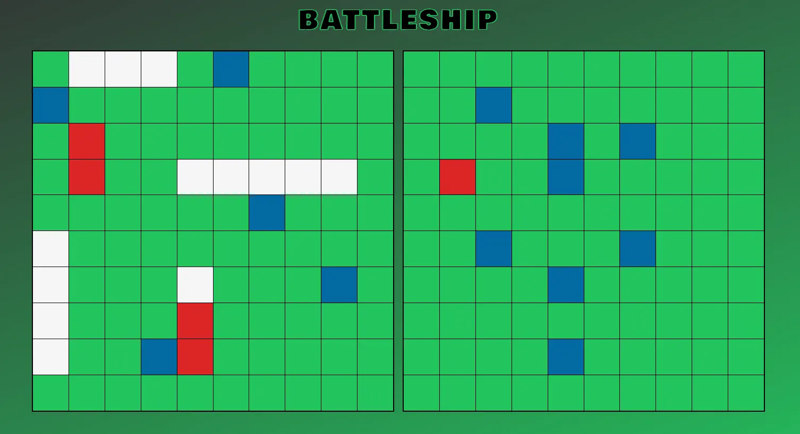
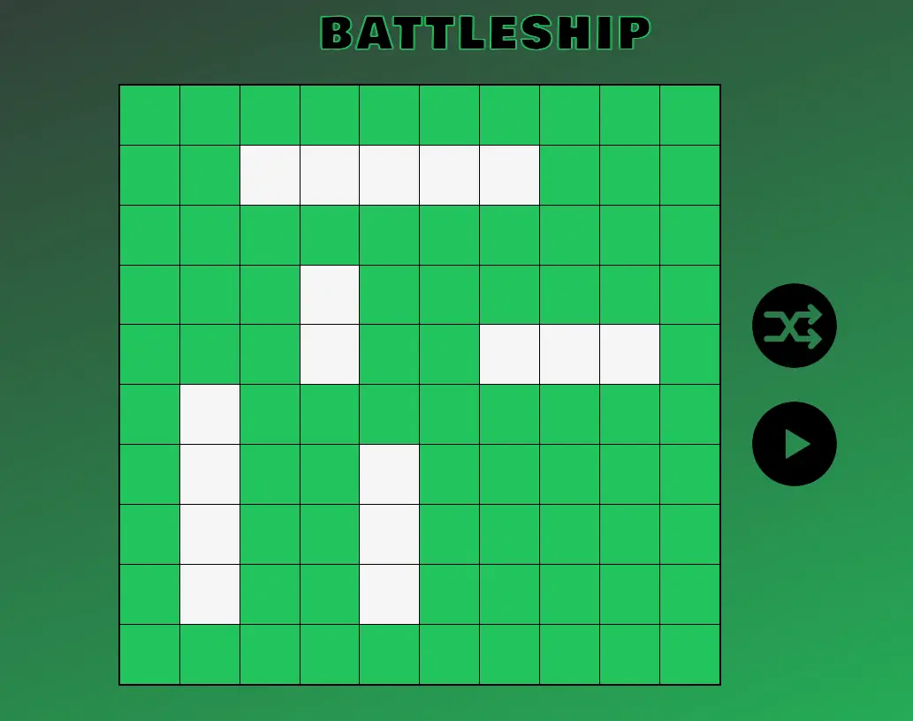

# Battleship

This is a basic implementation of the classic [Battleship game](<https://en.wikipedia.org/wiki/Battleship_(game)>) in JavaScript. The game is played on a 10x10 grid, in which both the player and the computer alternate turns to guess coordinates in an effort to sink their opponent's ships

- [Live Site](https://syeero7.github.io/battleship/)

## Features

- Intelligent computer player
- Randomized ship placement

## Screenshots

